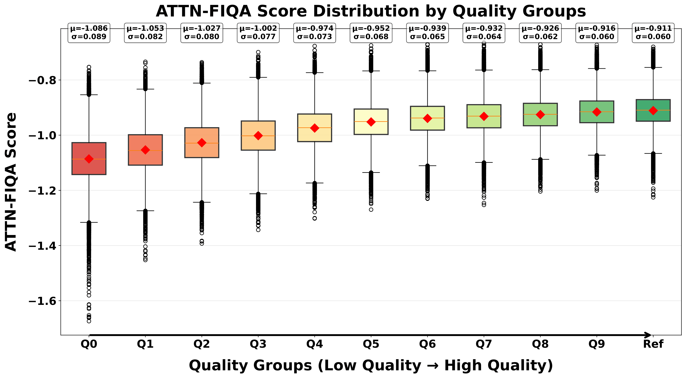
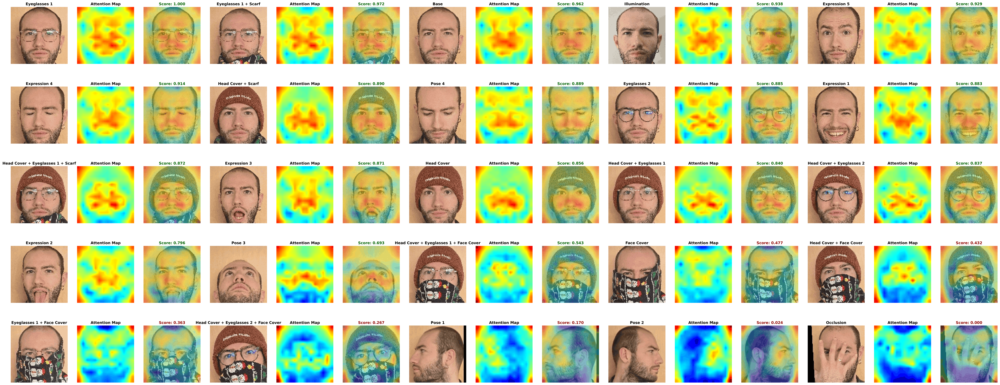
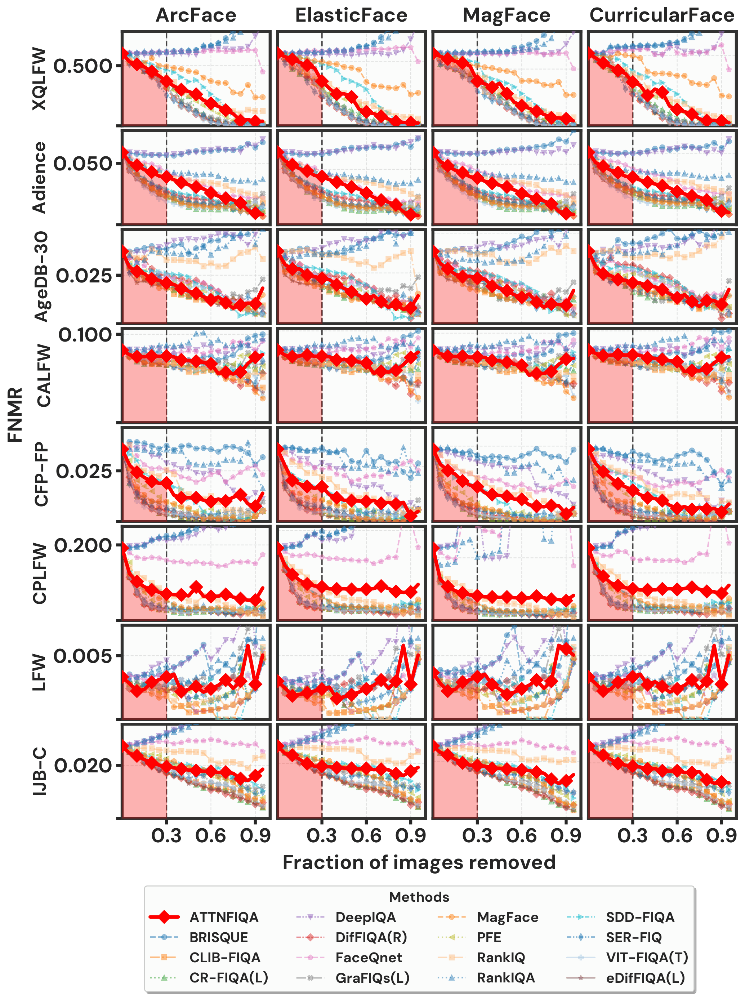

# ATTN-FIQA: Interpretable Attention-based Face Image Quality Assessment with Vision Transformers

This repository contains the official implementation of the paper **"[ATTN-FIQA: Interpretable Attention-based Face Image Quality Assessment with Vision Transformers]()"**, accepted at FG2026.

## Overview

**ATTN-FIQA** is a training-free Face Image Quality Assessment (FIQA) method that uses **pre-softmax self-attention scores** from pre-trained Vision Transformer (ViT) face recognition models.

Unlike existing approaches that require multiple forward passes, backpropagation, or additional training, ATTN-FIQA computes quality from a **single forward pass** by aggregating raw attention responses from the final transformer block.

The method is based on the hypothesis that high-quality face images produce stronger and more focused query-key alignments, while degraded images (e.g., blur, occlusion, illumination issues) lead to weaker and more diffuse attention patterns.

## Key Features

- **Training-Free**: No fine-tuning, no extra FIQA-specific training, and no architectural modifications
- **Single Forward Pass**: Efficient inference with minimal overhead
- **Interpretable**: Attention maps indicate which facial regions contribute to quality estimation
- **Model-Agnostic for ViTs**: Applicable to pre-trained ViT-based FR backbones
- **Comprehensive Evaluation**: Validated across multiple benchmark datasets and FR models

## Empirical Validation on SynFIQA

    
     
    <em>Figure 1: Empirical validation of ATTN-FIQA on SynFIQA. Distribution of ATTN-FIQA scores across 11 quality groups (Q0-Q9 and Ref), showing monotonic score increase from lowest-quality degraded images to reference images.</em>

## Attention Visualization on Controlled Conditions

    
     
    <em>Figure 2: Attention visualization for controlled quality conditions using ViT-S/WebFace4M/AdaFace. High-quality images exhibit focused, high-magnitude attention on discriminative regions, while degraded conditions show diffuse, low-magnitude attention.</em>

## Error-versus-Discard Performance

    
     
    <em>Figure 3: EDCs for FNMR@FMR=1e-3 comparing ATTN-FIQA with state-of-the-art methods across eight benchmark datasets and four face recognition models. ATTN-FIQA is shown with solid red curves.</em>

## Pretrained Models

Place the required pre-trained model files in the `pretrained/` directory. Commonly used checkpoints in this repository include:

Download the pretrained ViT-B face recognition model from [CVL-Face](https://huggingface.co/minchul/cvlface_adaface_vit_base_webface4m) and place it in the `pretrained/` directory:
- `minchul_cvlface_adaface_vit_base_webface4m.pt`

Download the pretrained ViT-S face recognition model from [here]() and place it in the `pretrained/` directory:
- `vits_wf4m_adaface.pt`
- `vits_wf4m_arcface.pt`

## Usage

1. Configure dataset/model paths in the corresponding script files.
2. Run quality extraction and visualization scripts from the `evaluation/` directory.
3. Run ERC evaluation scripts to reproduce quality-performance analyses.

## Citation

## License

>This project is licensed under the terms of the **Attribution-NonCommercial-ShareAlike 4.0 International (CC BY-NC-SA 4.0)** license.
Copyright (c) 2026 Fraunhofer Institute for Computer Graphics Research IGD Darmstadt
For more details, please take a look at the [LICENSE](./LICENSE) file.
